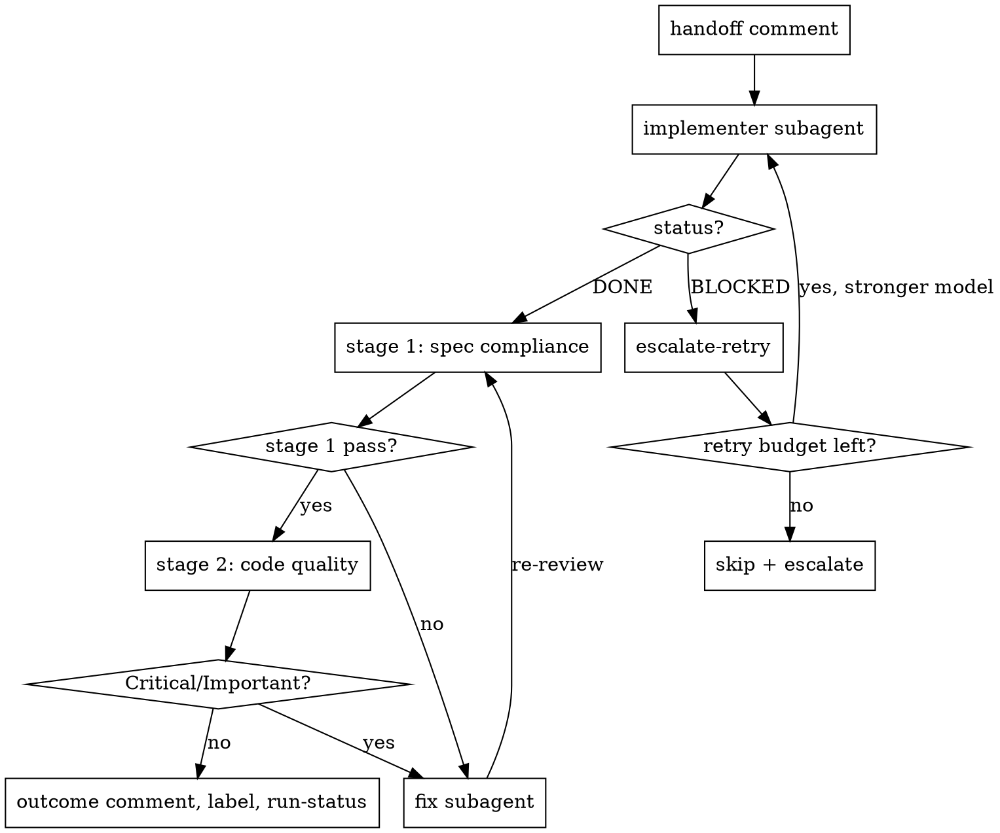

# Ship It

Autonomously implement every agent-ready child of a parent issue: one branch,
per-issue test-first implementation, two-stage review, fixes, a final
whole-branch review, and one pull request. No human in the loop until the PR
is raised.

This is a coordination skill. It dispatches and supervises subagents; it does
not write feature code itself.

## When to use

- A parent/epic issue has child issues, each with clear, agent-ready
  requirements — a description and acceptance criteria.
- The whole batch should be implemented unattended.
- Human review belongs on the finished PR, not mid-run.

Do not use when issues lack acceptance criteria, or when the work needs human
decisions mid-flight — those issues are labelled `hitl` and are skipped.

## Invocation

Required: a parent issue reference.

Optional config (sensible defaults):

| Option | Default | Purpose |
|---|---|---|
| base branch | `main` | what the work-set branch is created from |
| disabled skills | none | force-off augmentation skills |
| role-binding overrides | see registry | swap the skill filling a role |
| retry budget | 1 | escalate-retry attempts per issue before skip |
| circuit-breaker threshold | 1/3 of the batch | halt the run if failures exceed it |
| `discord-notify` | `on` | Post run-complete summary to Discord (requires `SHIP_IT_DISCORD_WEBHOOK_URL`) |

## The five phases

```
Phase 0  SETUP          resolve children, filter AFK, sort by deps, branch,
                        detect skills, post run-status, fire run-start
Phase 1  PER-ISSUE LOOP sequential, dependency order — see flowchart below
Phase 2  FINAL REVIEW   whole-branch review, fix Critical/Important, fire pre-pr
Phase 3  RAISE PR       open the PR with the rollup body
Phase 4  NOTIFY         fire run-complete
```

The per-issue loop:



A non-converging fix loop is treated like `BLOCKED`: it routes to
escalate-retry. Skipping an issue cascade-skips its dependents. The flowchart
shows the `DONE` and `BLOCKED` paths only; `DONE_WITH_CONCERNS` and
`NEEDS_CONTEXT` are handled per the Subagent contract in
`references/running-a-batch.md`.

**REQUIRED:** read `references/running-a-batch.md` for the full per-phase
procedure, the subagent contract, failure handling, and the comment protocol
before starting a run.

## Skill registry

Every external skill the orchestrator invokes is declared here. **Role
bindings** fill a required workflow role — the role is fixed, the skill is
configurable. **Augmentation skills** are optional and attach to a hook point.

| Binding | Kind | Default | Attaches at | Enabled |
|---|---|---|---|---|
| `implementer` | role | `tdd` | per-issue implement | required |
| `reviewer` | role | `pr-review-toolkit:review-pr` | stage-2 + final review | required |
| `fix` | role | (the `implementer` binding) | fix loop | required |
| `obsidian-wiki` | augmentation | `obsidian-wiki` | `post-issue-complete` | on if available |
| `ui-journey` | augmentation | `ui-journey` | `post-issue-complete` | on if available |
| `discord-notify` | inline | — | `run-complete` | on (requires `SHIP_IT_DISCORD_WEBHOOK_URL`) |

To add an augmentation skill later: add a row here and a short section in
`references/running-a-batch.md`. No backbone changes.

## Hook points

| Hook | Fires |
|---|---|
| `run-start` | after setup, before the loop |
| `post-issue-complete` | after an issue passes review and commits |
| `pre-pr` | after final review, before the PR |
| `run-complete` | after the PR is raised |

## Capability detection

At `run-start`, check skill availability:

- An augmentation skill that is not installed is **silently skipped**.
- A missing **role** skill is a **hard error** — the run cannot start without
  an implementer and a reviewer.
- Invocation config can disable augmentations or swap role bindings.

## The tracker

All issue-tracker reads and writes go through `scripts/tracker.mjs` — never
call `gh` directly from orchestration logic. Operations:

```
node scripts/tracker.mjs list-children <parent>
node scripts/tracker.mjs get-issue <issue>
node scripts/tracker.mjs upsert-comment <issue> <marker> <body-file>
node scripts/tracker.mjs read-comment <issue> <marker>
node scripts/tracker.mjs add-label <issue> <label>
node scripts/tracker.mjs create-pr <head> <base> <title> <body-file>
```

The script is the single backend layer; a non-GitHub tracker replaces it
alone.
